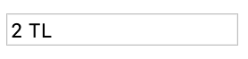
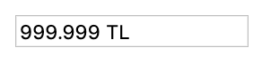

# Currency Viewer with jQuery

This repo was created to divide the currency into thousands of slices and to add the currency to the end of the amount. 
> **Note:** Used **jQuery** in this project. 
```

```
```

```
```

```
```

```
