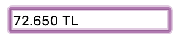

# Currency Viewer with jQuery

This repo was created to divide the currency into thousands of slices and to add the currency to the end of the amount. 
> **Note:** Used **jQuery** in this project. 
    

> **Text imput is empty**  

  
> **Text imput include just one char amount**  

  
> **Text imput include regular usage image**  

  
> **Text imput with maximum amount image**  

